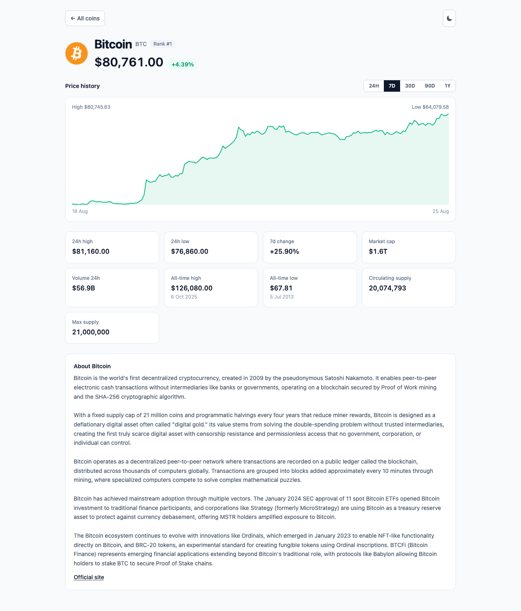

# Crypto Market Dashboard

Live cryptocurrency market dashboard built with React, TypeScript, Tailwind CSS and axios,
against the free [CoinGecko API](https://docs.coingecko.com/reference/coins-markets).

**[→ Live demo](https://crypto-market-doashboard.vercel.app/)**


<details>
<summary>Coin detail page, and dark theme</summary>




</details>

## Features

| | |
|---|---|
| **Data** | axios client, 10s timeout, retry with backoff, 60s TTL cache |
| **Grid** | 1 column mobile → 2 tablet → 3 laptop → 4 desktop |
| **Card** | Icon, name, symbol, USD price, 24h change (green/red), market cap, 24h volume, rank |
| **Search** | Debounced keyword search via the API, across the whole market |
| **Sort** | Market cap or 24h volume, both server-side |
| **Paging** | Server-side, one request per page, 10/20/50/100 per page |
| **Detail page** | Own URL per coin, market stats, description |
| **Chart** | Inline SVG price history, 24H/7D/30D/90D/1Y, hover or tap to inspect |
| **States** | Loading skeletons, error + retry, empty results, network recovery |
| **Bonus** | Dark/light theme (persisted), 338 Playwright E2E tests |

## Quick start

Requires **Node 20+**.

```bash
npm install
npm start                    # http://localhost:3000

npx playwright install chromium   # once
npm test                     # 338 passed, 8 skipped
```

No API key needed — the endpoint is public and `.env` ships with working defaults.

### Scripts

| Command | |
|---|---|
| `npm start` | Dev server |
| `npm run build` | Production build |
| `npm test` | Playwright E2E (boots the dev server itself) |
| `npm run test:e2e:ui` | Playwright UI mode |

### Configuration

All optional. `.env` holds non-secret defaults; copy `.env.example` to `.env.local` to
override, including an API key. Note CRA inlines `REACT_APP_*` at **build** time, so
restart after editing. Malformed values fall back to their default.

| Variable | Default |
|---|---|
| `REACT_APP_COINGECKO_BASE_URL` | `https://api.coingecko.com/api/v3` |
| `REACT_APP_COINGECKO_API_KEY` | *(blank — unauthenticated)* |
| `REACT_APP_COINGECKO_API_KEY_HEADER` | `x-cg-demo-api-key` |
| `REACT_APP_COINS_PER_PAGE` | `20` |
| `REACT_APP_CACHE_TTL_MS` | `60000` |
| `REACT_APP_REQUEST_TIMEOUT_MS` | `10000` |

**Never put a real key in `.env`** — it is committed. That is what `.env.local` is for.

## Architecture

```
src/
├── api/         client.ts (axios + retry)  coins.ts  search.ts
│                coinDetail.ts  coinChart.ts
├── config/      env.ts — REACT_APP_* with validation and defaults
├── types/       wire responses → domain models, all nullable fields typed
├── hooks/       useCoins  useCoinSearch  useCoinDetail  useCoinChart
│                useDebouncedValue  useTheme
├── lib/         cache.ts (TTL)  format.ts  chart.ts (pure SVG geometry)
├── components/  CoinCard CoinGrid SearchBar SortControls Pagination
│                PriceChart ChartRangeSelect StatGrid ThemeProvider  states/
├── pages/       DashboardPage  CoinDetailPage  NotFoundPage
└── App.tsx      router shell
e2e/             Playwright specs, fixtures, mocks
```

`api/` is the only layer that knows HTTP, `hooks/` the only one holding async state,
`lib/` is pure, `components/` take props. `App.tsx` is the only stateful component.

## Key decisions

**Price and 24h change are not sortable — deliberately.** CoinGecko's `order` supports
`market_cap_*`, `volume_*` and `id_*`. Ask it for `price_desc` and it returns **200 with
plain market-cap ordering** rather than an error, so those sorts would look functional and
do nothing. They were removed; volume was added because it genuinely works. `MarketsOrder`
is a template union of field × direction, making an ignored value unrepresentable.

**Search is two requests, debounced 400ms.** `/coins/markets` takes no keyword, so
`/search` resolves the keyword to ids and `/coins/markets?ids=…` supplies the prices
`/search` omits. This reverses an earlier no-debounce decision: right for an in-memory
filter, wrong once a keystroke costs two requests. Responses for superseded queries are
discarded. Search covers the whole market, so the pager hides while it is active.

**The chart is hand-written SVG, not a chart library.** The deciding factor was
testability, not bundle size: this project tests only through Playwright, and a canvas
chart (Chart.js, lightweight-charts) needs pixel snapshots, while an SVG path exposes its
point count, labels and tooltip to ordinary assertions. It also costs no dependency.
Points are capped at 600 — the 90-day range returns ~2161 hourly points for an ~800px
chart — with the true high and low always retained, since those are the values a reader
is looking for.

**The detail page issues two independent requests.** Stats come from `/coins/{id}` and
the series from `/coins/{id}/market_chart`, so a chart failure leaves the figures on
screen and switching range never refetches the description. `days=max` is not offered:
the free tier rejects it with error 10012, capping history at 365 days.

**Coin descriptions are rendered as text, never as HTML.** CoinGecko embeds `<a>` tags in
them; a test serves a description containing an anchor and an `img` with an `onerror`
handler to prove neither reaches the DOM.

**Nothing is sorted or filtered locally.** The API is the single source of ordering, which
is why `src/lib/sort.ts` doesn't exist.

**Caching is two-tier and keyed by request.** An in-memory `Map` over `sessionStorage`,
keyed by order + page size + page (and by query for search), with a 60s TTL because the
free tier rate-limits hard. Requests are also coalesced — StrictMode's double effect and a
refresh click must not become two calls. All storage access is wrapped: Safari private
mode makes `sessionStorage` *throw*.

**Retries are selective.** Two retries, 300/600ms backoff, on 429s, 5xx, timeouts and
dropped connections — never on 4xx, which means our request was wrong.

**Price precision follows magnitude.** Two decimals at or above a dollar, up to eight
below it — so BTC reads `$80,819.00` and SHIB `$0.00002341`. A single 8-decimal formatter
looked fine until chart data arrived: `/coins/markets` returns pre-rounded prices but
chart series carry raw floats, which surfaced as `High $2,524.34151352`. Trend follows the
*rounded* value,
so a stablecoin at `-0.0004%` shows a neutral `0.00%`, not a red loss. Nullable fields
(`market_cap_rank`, `price_change_percentage_24h`) are typed as such — both are genuinely
null at the bottom of the market.

**Chose CRA over Vite** because it was requested. `react-scripts` is unmaintained since
2022 and its transitive deps show up in `npm audit`; that's dev-only build tooling, not
shipped code, but Vite would be the real fix.

## Testing

Playwright only, every request mocked — that's what makes a 500, a dropped connection, or
a null 24h change assertable on demand, and keeps the suite off the rate limit.

```bash
npm test        # 338 passed, 8 skipped
```

The 5 skips are viewport-driven responsive tests, scoped to the desktop project so they
run once. Full RED/GREEN evidence and all 82 behavioural guarantees:
[`docs/testing/crypto-market-dashboard.tdd.md`](docs/testing/crypto-market-dashboard.tdd.md).

## With more time

- **Page number in the URL** — paging is component state, so a page can't be linked.
- **Compare two coins on one chart**, and candlesticks via `/ohlc`.
- **A labelled "reorder these results" control** — gives price/24h change back honestly,
  scoped to the loaded set rather than pretending to be market-wide.
- **Migrate off CRA.**

## Licence

MIT
