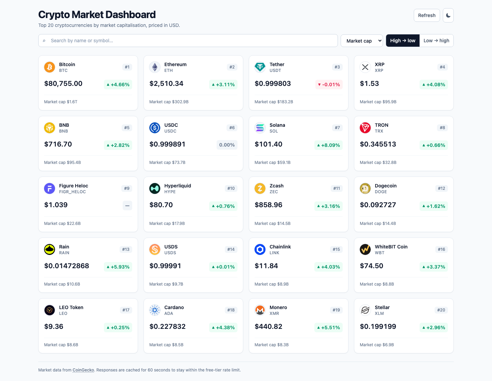
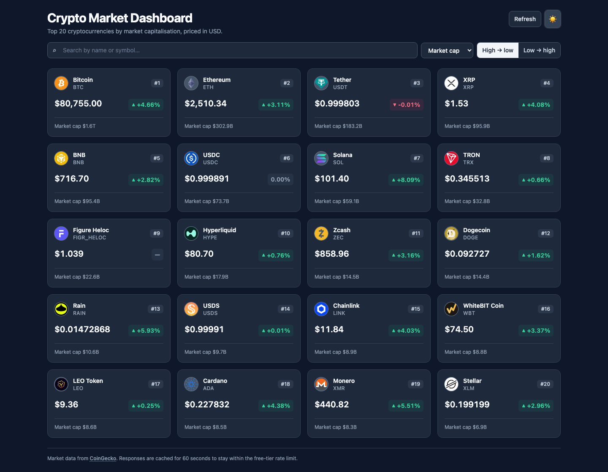

# Crypto Market Dashboard

A responsive dashboard showing the top 20 cryptocurrencies by market cap, built with
React, TypeScript, Tailwind CSS and axios, against the free
[CoinGecko API](https://docs.coingecko.com/reference/coins-markets).



<details>
<summary>Dark theme</summary>



</details>

## Features

| Requirement | How it works |
|---|---|
| **Data fetching** | axios client with a 10s timeout, retry-with-backoff, and a 60s TTL cache |
| **Responsive grid** | 1 column on mobile, 2 on tablet, 3 on laptop, 4 on desktop |
| **Card content** | Icon, name, symbol, USD price, 24h change (green up / red down), market cap and rank |
| **Search** | Filters by name *or* symbol, case- and whitespace-insensitive |
| **Sort** | Market cap, price or 24h change, ascending or descending |
| **Edge cases** | Loading skeletons, error state with retry, empty search state, network-failure recovery |
| **Bonus** | Dark/light theme toggle (persisted), and a Playwright E2E suite |

## Getting started

**Prerequisites:** Node 20 LTS or newer, and npm 9+.
(Developed and verified on Node 26; `react-scripts` 5 is unmaintained, so if you hit an
install or build error on a very new Node, Node 20 LTS is the safe fallback.)

```bash
npm install
npm start          # http://localhost:3000
```

No API key or setup is needed — the CoinGecko markets endpoint is public, and `.env`
ships with working defaults.

### Configuration

All configuration is optional. `.env` is committed with non-secret defaults so the app
runs with zero setup; `.env.example` documents every variable. To override anything —
including a real API key — copy it to `.env.local`, which is gitignored:

```bash
cp .env.example .env.local
```

| Variable | Default | Purpose |
|---|---|---|
| `REACT_APP_COINGECKO_BASE_URL` | `https://api.coingecko.com/api/v3` | API root. Use `https://pro-api.coingecko.com/api/v3` with a Pro key. |
| `REACT_APP_COINGECKO_API_KEY` | *(blank)* | Optional key; raises the rate limit. Blank means unauthenticated. |
| `REACT_APP_COINGECKO_API_KEY_HEADER` | `x-cg-demo-api-key` | Demo plans use this; Pro plans use `x-cg-pro-api-key`. |
| `REACT_APP_COINS_PER_PAGE` | `20` | How many coins to request. |
| `REACT_APP_CACHE_TTL_MS` | `60000` | How long a fetched list stays fresh. |
| `REACT_APP_REQUEST_TIMEOUT_MS` | `10000` | Per-request timeout. |

Two things worth knowing. Create React App inlines `REACT_APP_*` at **build** time, so
restart `npm start` after editing. And every value is validated in `src/config/env.ts` —
a malformed number falls back to its default rather than becoming `per_page=NaN` in a
live request.

**Never put a real key in `.env`** — it is committed. That is what `.env.local` is for.

### Scripts

| Command | What it does |
|---|---|
| `npm start` | Dev server on port 3000 |
| `npm run build` | Production build into `build/` |
| `npm test` / `npm run test:e2e` | Playwright E2E suite (starts the dev server automatically) |
| `npm run test:e2e:ui` | Playwright UI mode, for stepping through tests |
| `npm run test:e2e:report` | Open the HTML report from the last run |

First test run needs the browser binary once:

```bash
npx playwright install chromium
```

## Architecture

```
src/
├── api/
│   ├── client.ts        axios instance, retry interceptor, error→message mapping
│   └── coins.ts         typed fetch + request coalescing + cache key
├── config/env.ts        REACT_APP_* config with validation and defaults
├── types/coin.ts        CoinMarketResponse (wire) and Coin (domain)
├── hooks/
│   ├── useCoins.ts      loading / error / data, retry and force-refresh
│   └── useTheme.ts      dark mode, persisted to localStorage
├── lib/
│   ├── cache.ts         TTL cache: in-memory tier over sessionStorage
│   ├── format.ts        price and percentage formatting, trend derivation
│   └── sort.ts          pure filterCoins / sortCoins
├── components/
│   ├── CoinCard, CoinGrid, SearchBar, SortControls, ThemeToggle
│   └── states/          SkeletonGrid, ErrorState, EmptyState
└── App.tsx              owns search/sort state, picks which state to render
e2e/                     Playwright specs, fixtures and helpers
```

The layering rule: `api/` is the only place that knows HTTP, `hooks/` is the only place
that holds async state, `lib/` is pure and side-effect free, and `components/` receive
props and render. `App.tsx` is the only stateful component.

### Decisions and tradeoffs

**Why a custom hook instead of React Query or SWR.** The app makes exactly one request.
A data-fetching library would bring caching, retries and deduplication I'd otherwise
write — but it would also hide the part of the brief that's actually being assessed.
Writing `useCoins` plus a small cache keeps the caching strategy explicit and readable.
At two or three more endpoints I'd switch to React Query rather than grow this.

**Caching is two-tier and deliberately short-lived.** An in-memory `Map` serves
re-renders; `sessionStorage` survives a reload but is scoped to the tab, so opening the
dashboard fresh always gets fresh prices. The TTL is 60s because CoinGecko's free tier
rate-limits aggressively and prices don't move meaningfully faster than that. All
storage access is wrapped in `try/catch` — Safari private mode makes `sessionStorage`
*throw* rather than return null.

**Requests are coalesced, not just cached.** React StrictMode intentionally double-invokes
effects in development, and a user can hit Refresh while a load is running. Both would
fire duplicate requests at a rate-limited API, so `fetchCoins` returns the in-flight
promise when one exists.

**Retries are selective.** The interceptor retries twice with 300ms/600ms backoff on
429s, 5xx, timeouts and dropped connections. It never retries a 4xx: that means our
request was wrong, and retrying would only spend the rate limit faster.

**One price formatter for the whole range.** `Intl.NumberFormat` with
`minimumFractionDigits: 2` and `maximumFractionDigits: 8` renders BTC as `$80,819.00`
and SHIB as `$0.00002341`. A naive two-decimal formatter collapses every sub-cent coin
to `$0.00`.

**Trend follows the displayed number, not the raw one.** The live API returns changes
like `-0.0004%` for stablecoins. Deriving colour from the raw value painted a red
`-0.00%` — a loss the user can see didn't happen. Both the label and the trend now key
off the value rounded to display precision.

**Nulls sink to the bottom when sorting.** `price_change_percentage_24h` is genuinely
nullable in the live API. Treating null as `0` would rank an unknown change above every
real loss; "no data" is not "flat", so nulls sort last in *both* directions.

**No debounce on search.** Filtering 20 in-memory coins is synchronous. A debounce would
only add latency between keystroke and result.

## Testing

Playwright is the only test runner, and every spec mocks the network with `page.route()`
against a fixture. That's what makes the interesting assertions possible at all — you
can't ask the live API for a 500, a dropped connection, or a coin with a null 24h change
on demand. It also means the suite never burns the rate limit and never flakes on real
price movement.

```bash
npm run test:e2e
```

**97 passed, 5 skipped** across a desktop and a mobile project. The 5 skips are the
viewport-driven responsive tests, scoped to the desktop project so they run once.

| Spec | Covers |
|---|---|
| `dashboard.spec.ts` | 20 cards render; price and percentage formatting; green/red/neutral trend; sub-cent prices; null change; changes that round to zero; no `NaN` leaking into the DOM |
| `search-sort.spec.ts` | Filter by name and by symbol; case and whitespace; sort all three fields both directions; nulls last; search and sort combined |
| `edge-cases.spec.ts` | Skeletons while loading; 500 and 429 error states; retry that actually recovers; dropped connection; empty search results |
| `responsive.spec.ts` | 1/2/3/4 columns at 390/768/1024/1440px; no horizontal overflow at 320px |
| `caching.spec.ts` | One request on load; reload served from cache; refresh bypasses it; TTL expiry re-fetches |
| `api-request.spec.ts` | The outgoing query matches the brief; `per_page` is never `NaN`; no API key header when unset |
| `theme.spec.ts` | Dark mode toggle, round trip, persistence across reload, and the storage key the pre-paint script depends on |

The fixture in `e2e/fixtures/coins.ts` is shaped so each edge case has exactly one
unambiguous answer — a unique highest price, a unique biggest gainer, one coin with a
null change, one sub-cent price.

Beyond the suite, the app was verified against the live API: one network request,
20 cards, real prices. That live run is what surfaced the `-0.00%` bug.

## What I'd do with more time

- **Coin detail page with a price chart** — needs a router and a chart library, and the
  `/coins/{id}/market_chart` endpoint. The biggest missing feature.
- **Pagination or infinite scroll** — the brief pins the list at 20, so paging would be
  speculative until the page size becomes a real requirement.
- **Unit tests for `lib/`** — the pure functions are currently covered through the DOM.
  E2E proves the user-visible behaviour, but a Vitest layer over `format.ts` and
  `sort.ts` would pin edge cases faster than a browser round trip.
- **Migrate off Create React App** — `react-scripts` has been unmaintained since 2022 and
  its transitive dependencies show up in `npm audit`. They're dev-only build tooling, not
  shipped code, so it isn't a production risk, but Vite would be the real fix.
- **Auto-refresh with a visible "last updated" timestamp** — a 60s interval that respects
  page visibility, so a backgrounded tab doesn't poll.

## Testing notes

A full TDD evidence report — user journeys, RED/GREEN output for each stage, the
42 behavioural guarantees and the known gaps — lives in
[`docs/testing/crypto-market-dashboard.tdd.md`](docs/testing/crypto-market-dashboard.tdd.md).

## Licence

MIT
